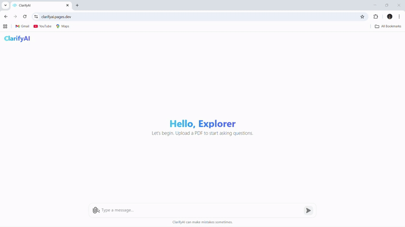

# ClarifyAI 

> ClarifyAI is an intelligent PDF chatbot built with a Retrieval-Augmented Generation (RAG) pipeline. It allows you to upload a PDF document and ask specific questions about its content, receiving accurate answers drawn directly from the text.

This project leverages a modern, serverless architecture to provide a seamless and efficient user experience.

- **Chat with Your Documents:** Simply upload a PDF and start a conversation. Get insights and answers without manually searching through pages.
- **Context-Aware Answers:** Powered by a RAG pipeline, the chatbot provides answers based only on the content of your uploaded document, avoiding generic or external information.
- **Serverless Deployment:** Built with Cloudflare Workers and Pages for high scalability and low latency. The PDF text extraction is handled by a separate microservice deployed on Hugging Face.
- **Vector Search:** Uses Cloudflare's Vectorise DB to perform efficient similarity searches on document embeddings, ensuring relevant context is retrieved quickly.

## Demo



## Table of Contents

1. [Tech Stack and Prerequisites](#1-tech-stack-and-prerequisites)
2. [How to Install and Run the Project](#2-how-to-install-and-run-the-project)
3. [How to Use the Project](#3-how-to-use-the-project)
4. [Future Improvements](#4-future-improvements)
5. [Acknowledgements](#5-acknowledgements)
6. [License](#6-license)

## 1. Tech Stack and Prerequisites

**Frontend:** React, Cloudflare Pages\
**Backend:** Cloudflare Workers\
**Prerequisites:** Cloudflare Account, Node.js and npm, Git

## 2. How to Install and Run the Project

**For Developers: Deploying Your Own Instance** 
- If you want to deploy your own version of this project, you will need a Cloudflare account and the Wrangler CLI installed. The following steps will guide you through the process.

**1. Set Up the Database via Command Line:**
- First, you need to create the Vectorize database and its required metadata index using the Wrangler command-line tool.
 - **Create the Vector Database:** Open your terminal and run this command. It creates the main vector store named clarifyai.
 ```
 npx wrangler vectorize create clarifyai --dimensions=768   --metric=cosine
 ```
 - **Create the Metadata Index:** This command adds a necessary index to the database for filtering by text metadata.
 ```
 npx wrangler vectorize create-metadata-index clarifyai  --property-name=text --type=string
 ```

**2. Deploy the Backend Worker:**
- Before deploying the code, you need to create the vector database that will store the document embeddings.
 - Navigate to your Cloudflare Dashboard.
 - Go to Workers & Pages and select Create application.
 - Choose Workers and click Create worker.
 - Select Import from Git and choose Import a public Git repo.
 - Paste the project's Git repository URL.
 - In the deployment settings, set the Root directory to backend.
 - Deploy the worker.

**3. Deploy the Frontend with Pages:**
- Return to the Cloudflare Dashboard and once again select Create application.
- This time, choose the Pages tab and select Connect to Git.
- Connect to the same GitHub repository.
- In the Build settings:
   - Set the Framework preset to React.
   - Set the Root directory to frontend.
- Save and deploy.

- Once the deployment is complete, Cloudflare will provide you with a unique URL for your Pages site (e.g., your-project.pages.dev). You can now use your own self-hosted instance of the application.

**4. Access the Application:**\
 Open your web browser and navigate to http://your-project.pages.dev.
 
## 3. How to Use the Project

- Upload a PDF file using the file upload button. The application currently supports PDFs with selectable/scannable text.
- Wait for the document to be processed and indexed in the vector database.
- Ask a question in the chat input field and press Enter.
- Receive an answer generated directly from the information contained within your PDF.

##  4. Future Improvements

- **OCR Support:** Implement Optical Character Recognition (OCR) to support scanned PDFs or documents containing images with text.
- **Multi-File Support:** Allow users to upload and query multiple PDF documents simultaneously.
- **Improved UI/UX:** Add features like viewing conversation history and highlighting source text in the PDF.

## 5. Acknowledgements

- [Cloudflare Workers Documentation](https://developers.cloudflare.com/workers/)
- [Cloudflare Pages Documentation](https://developers.cloudflare.com/pages/)
- [React Documentation](https://react.dev/)
- [Tailwind CSS Documentation](https://tailwindcss.com/docs/installation)
- [Flask Documentation](https://flask.palletsprojects.com/)

## 6. License

This project is licensed under the [MIT](LICENSE) License.
